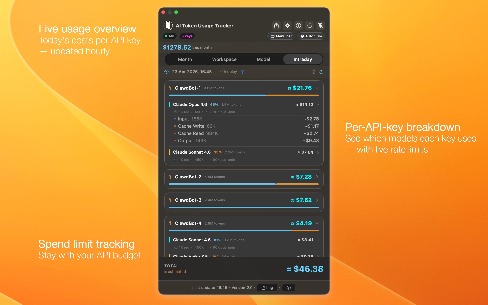
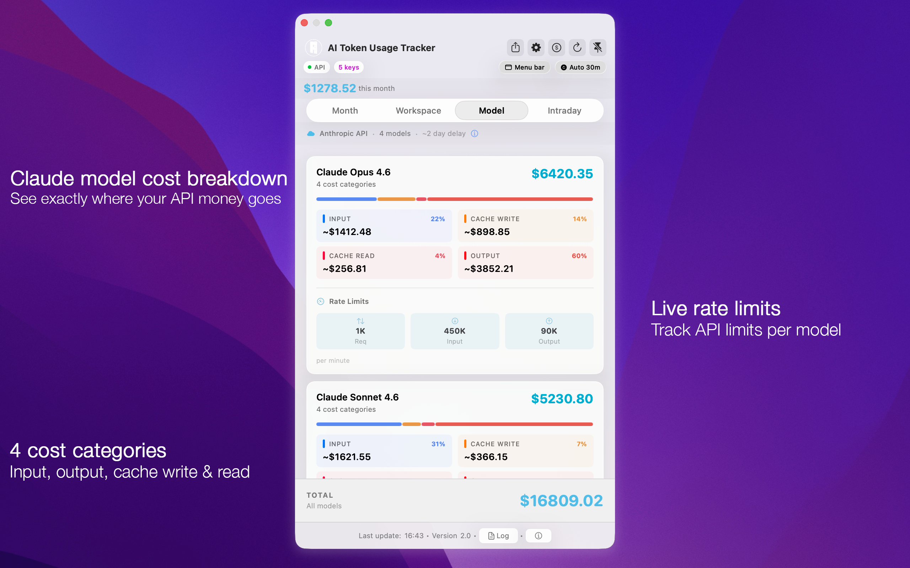
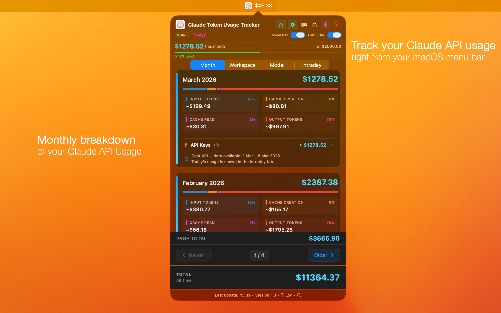
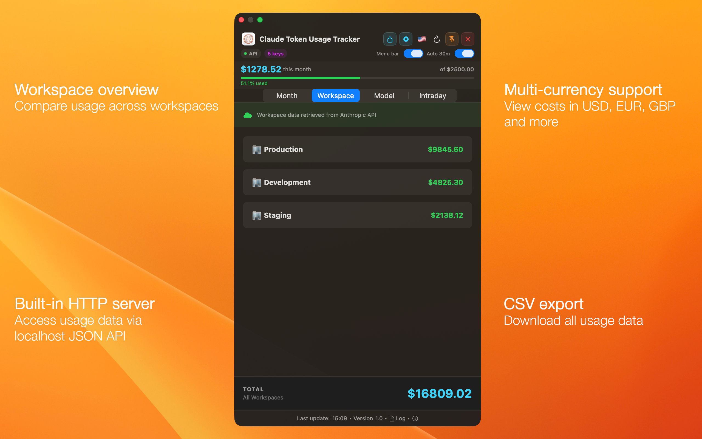
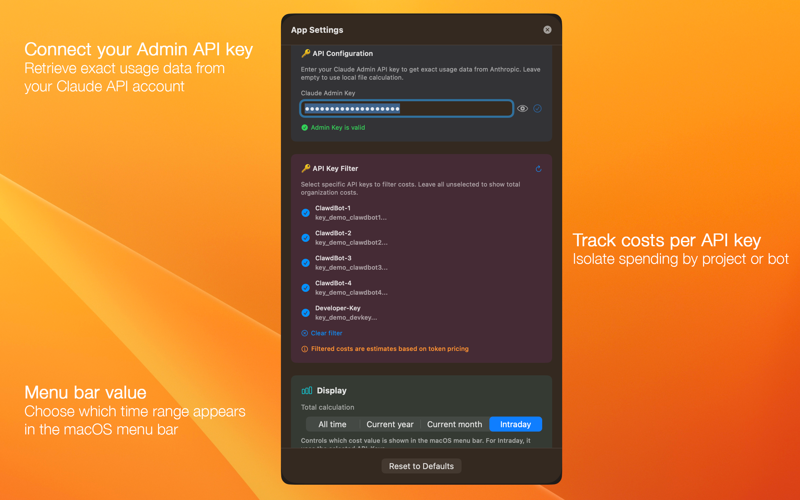
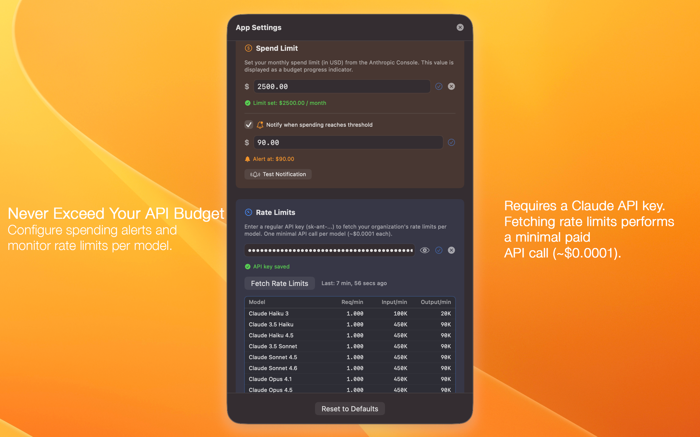
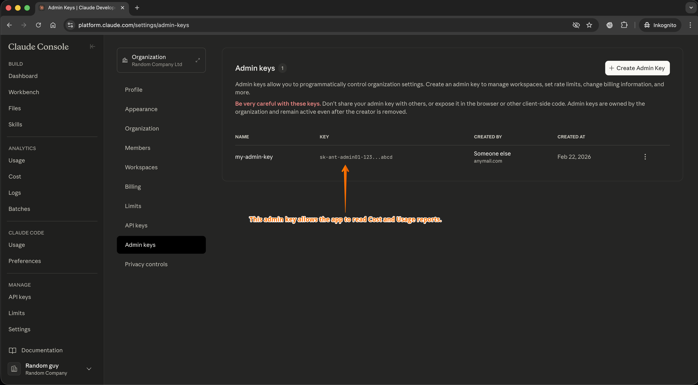

# AI Token Usage Tracker

### Know exactly what your Claude API costs — right from your macOS menu bar.

A native macOS menu bar app and **Claude API cost tracker** that connects to the **Anthropic Admin API** and shows your organization's token usage and costs in near real-time — broken down by month, model, workspace, and API key. Built for developers and teams running Claude via the API for coding agents, bots, or internal tools.

[🌐 Website](https://siegfriedbolz.github.io/claude-token-usage-tracker/) · [⬇️ Download](#download) · [🔒 Privacy Policy](https://siegfriedbolz.github.io/claude-token-usage-tracker/privacy-policy.html) · [🛟 Support](#support) · [🤖 llms.txt](https://siegfriedbolz.github.io/claude-token-usage-tracker/llms.txt)

---

## Screenshots

| Live usage overview | Model cost breakdown |
|---|---|
|  |  |

| Monthly breakdown | Workspace overview |
|---|---|
|  |  |

| Settings — API & Filter | Settings — Budget & Rate Limits |
|---|---|
|  |  |

---

## Why AI Token Usage Tracker?

If you're running Claude via the API — for coding agents (Cursor, Windsurf, Claude Code), bots, or internal tools — you need visibility into what you're spending. Anthropic's console gives you some data, but it's not always timely, and it's not on your menu bar.

This app pulls data from the Anthropic Admin API and puts your costs where you can always see them: in your macOS menu bar — or as a detached popover window that stays visible while you work. Auto-refreshes every 30 minutes (configurable) and includes a demo mode with sample data to try before connecting your API key.

> **Note:** This app tracks costs for **Anthropic API keys** only. It does not track usage or costs from Claude Desktop, Claude Pro/Team/Enterprise subscriptions, or Claude Code subscription plans. You need an Anthropic Admin API key with organization admin access.

---

## Features

### 📊 Near Real-Time Cost Tracking
See today's estimated API costs via the Intraday tab — updated with a delay of up to ~1 hour. The menu bar always shows your current spend at a glance.

### 📅 Monthly Breakdown
Full monthly cost history with pagination. See input tokens, output tokens, cache writes, and cache reads — each with their share of the total cost. Monthly data is based on Anthropic's Cost API (~2 day reporting delay).

### 🤖 Per-Model Cost View
Know exactly how much each Claude model costs you. Opus vs. Sonnet vs. Haiku — broken down into 4 cost categories (input, output, cache write, cache read) with percentage shares.

### 🔑 Per-API-Key Filtering
Track costs per API key to isolate spending by project, bot, or team member. Select specific keys or view total organization costs.

### 🏢 Workspace Overview
Compare usage across your Anthropic workspaces (Production, Development, Staging, etc.) at a glance.

### ⚡ Live Rate Limits
See your current rate limits per model — requests per minute, input tokens, and output tokens — fetched directly from the API.

### 💰 Spend Limit Tracking
Visual progress bar showing how much of your organization's spend limit has been consumed, with percentage tracking.

### 🔔 Spend Notifications
Set custom thresholds and get native macOS notifications when your spending crosses them.

### 💱 Multi-Currency Support
View all costs in USD, EUR, GBP, and more. Exchange rates are fetched daily.

### 📋 CSV Export
Export all usage data to CSV for reporting, accounting, or further analysis.

### 🌐 Built-in JSON API
Optional localhost HTTP server exposes your usage data as JSON — perfect for integrating with dashboards, scripts, or custom tooling. Endpoints: `GET /usage` for full data, `GET /health` for status. Bound to 127.0.0.1 only — no external network exposure.

### 🪟 Detached Window Mode
Detach the popover into a standalone window that stays visible while you work — no need to keep the menu bar popover open.

### 📌 Menu Bar Cost Display
Optionally show your current API spend directly in the macOS menu bar text, so you always know where you stand without clicking.

### 🔒 Secure by Design
Your Admin API key is stored in the **macOS Keychain** — never in plain text. Zero third-party dependencies. All Apple system frameworks.

> **Why does the app ask for my macOS password on first launch?**
> macOS requires your account password whenever a new app wants to create or access an entry in the system Keychain. This is a standard macOS security prompt — it means the system is *protecting* your data, not that the app is accessing anything else. The app only stores and reads its own Keychain item (your Anthropic Admin API key). No other passwords, credentials, or Keychain entries are accessed. See our [Privacy Policy](https://siegfriedbolz.github.io/claude-token-usage-tracker/privacy-policy.html) for full details.

---

## Getting Your Admin API Key

The app requires an **Anthropic Admin API key** to read your organization's usage and cost data. Here's how to get one:

1. **Log in** to the [Anthropic Console](https://platform.claude.com/settings/admin-keys) with an account that has **organization admin** access.
2. **Navigate** to **Organization Settings → Admin keys** (or go directly to [platform.claude.com/settings/admin-keys](https://platform.claude.com/settings/admin-keys)).
3. **Click** `+ Create Admin Key`, give it a name, and copy the key.
4. **Open** AI Token Usage Tracker → **Settings** → paste the key. It's stored securely in the macOS Keychain.

*The Admin keys page in the Anthropic Console — create your Admin key here and paste it into the app.*

The app queries the Anthropic Admin API for usage reports, API key metadata, workspace info, and rate limits. All data is cached locally to minimize API calls.

---

## Requirements

- **macOS 14.0** (Sonoma) or later
- An **Anthropic Admin API key** (requires organization admin access)
- No external dependencies — pure Apple system frameworks

---

## Download

<!-- TODO: Replace href with actual Mac App Store link -->

---

## Support

Found a bug or have a feature request?
Open an issue on [GitHub Issues](https://github.com/siegfriedbolz/claude-token-usage-tracker/issues).

---

## Privacy

AI Token Usage Tracker does **not** collect, transmit, or store any personal data. Your API key is stored exclusively in the macOS Keychain on your device. All API communication goes directly to Anthropic's servers — no intermediaries, no analytics, no tracking.

Read the full [Privacy Policy](https://siegfriedbolz.github.io/claude-token-usage-tracker/privacy-policy.html).

---

## License

AI Token Usage Tracker is proprietary software. All rights reserved.
Distributed exclusively via the Mac App Store under the [Apple Licensed Application End User License Agreement (EULA)](https://www.apple.com/legal/internet-services/itunes/dev/stdeula/).

---

AI Token Usage Tracker — Anthropic API cost monitor · token counter · usage analytics for macOS

© 2025–2026 Siegfried-Thor Bolz

